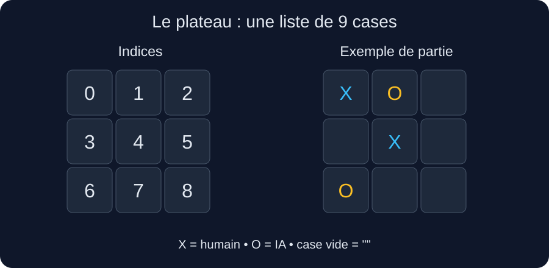
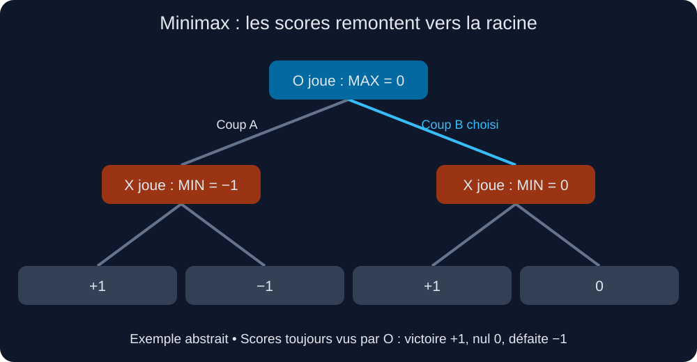

# Morpion — Python, Tkinter et Minimax

Un jeu de morpion dans lequel un joueur humain affronte une intelligence artificielle utilisant **Minimax**. Le projet sépare l’interface graphique de la logique de décision pour comprendre comment une IA explore les coups possibles.



## Sommaire

- [Lancer le projet](#lancer-le-projet)
- [Jouer](#jouer)
- [Organisation](#organisation)
- [Représentation du plateau](#représentation-du-plateau)
- [Comprendre Minimax](#comprendre-minimax)
- [Les fonctions du projet](#les-fonctions-du-projet)
- [Déroulement de la recherche](#déroulement-de-la-recherche)
- [Performances et limites](#performances-et-limites)
- [Dépannage](#dépannage)

## Lancer le projet

### Prérequis

- Python **3.9 ou supérieur**, pour les annotations comme `list[Any]` utilisées dans le code.
- Tkinter disponible dans l’installation Python.
- Un environnement graphique pour afficher la fenêtre.

Aucune bibliothèque Python tierce n’est nécessaire pour cette version : `tkinter` et `typing` appartiennent à la bibliothèque standard. Selon la distribution de Python, le support système de Tkinter peut toutefois devoir être installé séparément.

### Récupérer les sources

Clone ton dépôt, puis ouvre un terminal dans le dossier contenant `morpion.py` et `ia.py`. Tu peux également télécharger le dépôt en ZIP et l’extraire.

### Sous macOS ou Linux

Vérifie Python et Tkinter :

```bash
python3 --version
python3 -m tkinter
```

La deuxième commande doit ouvrir une petite fenêtre de démonstration. Ferme-la, puis lance le jeu :

```bash
python3 morpion.py
```

### Sous Windows

```powershell
py --version
py -m tkinter
py morpion.py
```

Si le lanceur `py` n’est pas disponible mais que Python est accessible avec `python`, utilise `python` à sa place.

> Les commandes et noms de fichiers de ce README correspondent à une interface dans `morpion.py` et à l’algorithme dans `ia.py`. Adapte-les si tes fichiers portent d’autres noms.

## Jouer

1. Le joueur humain joue **X** et commence.
2. Clique sur une case vide pour placer ton symbole.
3. L’IA calcule sa réponse et joue **O**.
4. Le premier joueur qui aligne trois symboles sur une ligne, une colonne ou une diagonale gagne.
5. Si le plateau est rempli sans gagnant, la partie est nulle.
6. Le bouton **Recommencer** réinitialise la partie.

Une case occupée ne peut pas être rejouée. L’interface bloque les coups humains pendant le tour de l’IA et après la fin de la partie.

## Organisation

| Fichier | Rôle |
|---|---|
| `morpion.py` | Fenêtre Tkinter, boutons, tours de jeu, affichage du résultat et réinitialisation |
| `ia.py` | Coups possibles, simulation, états terminaux, scores et recherche Minimax |
| `README.md` | Documentation du projet |
| `docs/images/` | Illustrations utilisées dans cette documentation |

L’interface importe le point d’entrée de l’IA :

```python
from ia import choisir_coup
```

Elle lui transmet une copie du plateau :

```python
index = choisir_coup(plateau.copy())
```

L’IA retourne uniquement l’indice choisi. C’est l’interface qui applique ensuite le coup réel et met à jour les boutons.

## Représentation du plateau

Le plateau est une liste de neuf chaînes de caractères :

```python
plateau = ["", "", "", "", "", "", "", "", ""]
```

| Valeur | Signification |
|---|---|
| `""` | Case vide |
| `"X"` | Symbole du joueur humain |
| `"O"` | Symbole de l’IA |

Les indices suivent l’ordre des lignes :

| | Colonne 0 | Colonne 1 | Colonne 2 |
|---|---|---|---|
| Ligne 0 | 0 | 1 | 2 |
| Ligne 1 | 3 | 4 | 5 |
| Ligne 2 | 6 | 7 | 8 |

Les huit alignements gagnants sont :

```python
combinaisons = [
    (0, 1, 2), (3, 4, 5), (6, 7, 8),  # Lignes
    (0, 3, 6), (1, 4, 7), (2, 5, 8),  # Colonnes
    (0, 4, 8), (2, 4, 6),             # Diagonales
]
```

## Comprendre Minimax

### Le principe

Minimax évalue les coups en supposant que **les deux joueurs jouent parfaitement**. L’IA imagine son coup, la meilleure réponse de l’adversaire, sa propre réponse, et ainsi de suite jusqu’à la fin de la partie.

Cette exploration forme un arbre : un nœud représente un plateau et le joueur dont c’est le tour ; une branche représente un coup ; une feuille représente une partie terminée.

### Les scores

Tous les scores sont exprimés **du point de vue de O**, même quand X joue.

| Résultat terminal | Score |
|---|---:|
| Victoire de O | +1 |
| Match nul | 0 |
| Victoire de X | −1 |

O cherche donc à **maximiser** le score. X cherche à le **minimiser** : une valeur faible pour O est favorable à X.

### Descendre, puis remonter

L’algorithme descend dans l’arbre en simulant des coups. Lorsqu’il atteint une partie terminée, il lui attribue un score. Les scores remontent ensuite : chaque nœud O conserve le maximum de ses enfants ; chaque nœud X conserve le minimum.



Dans cet arbre pédagogique, les deux coups de O mènent à des choix pour X :

- Après **A**, X peut obtenir +1 ou −1 du point de vue de O. X retient −1.
- Après **B**, X peut obtenir +1 ou 0. X retient 0.
- O compare donc −1 et 0, puis choisit **B**.

Cet arbre simplifié illustre le calcul des scores ; il ne représente pas toutes les suites d’un plateau particulier.

Minimax ne calcule pas une moyenne et ne compte pas les branches gagnantes. Il choisit le meilleur résultat que le joueur peut garantir face à la meilleure réponse adverse.

### Définition mathématique

Pour un état `s`, sa valeur est :

- `utility(s)` si la partie est terminée ;
- le maximum des valeurs des états suivants si O doit jouer ;
- le minimum des valeurs des états suivants si X doit jouer.

Le joueur change après chaque coup simulé. Chaque simulation remplit une case vide : la profondeur de la recherche est donc limitée par le nombre de cases libres.

## Les fonctions du projet

### `mouvement_possible(plateau)`

Retourne les indices des cases vides. Par exemple, pour :

```python
["X", "O", "", "", "X", "", "O", "", ""]
```

les coups possibles sont `[2, 3, 5, 7, 8]`.

### `future_state(plateau, action, joeur)`

Crée une copie du plateau avec `plateau[:]`, puis place le symbole du joueur à l’indice `action`. Le paramètre `joeur` reprend l’orthographe du code actuel.

La copie permet d’explorer une branche sans modifier les autres. Cette copie superficielle suffit ici, car le plateau est une liste plate de chaînes immuables. La fonction suppose que l’action est légale et que le symbole reçu est X ou O.

### `is_terminal(plateau)`

Vérifie d’abord les alignements gagnants, puis le remplissage du plateau. Elle retourne un couple :

| Retour | Sens |
|---|---|
| `(True, "X")` | X a gagné |
| `(True, "O")` | O a gagné |
| `(True, "nul")` | Plateau rempli sans gagnant |
| `(False, None)` | Partie en cours |

Le test d’alignement exige que le symbole soit non vide : trois cases vides ne constituent pas une victoire.

Il faut récupérer le booléen du couple avant de le tester :

```python
terminate, _ = is_terminal(plateau)
```

Tester directement le couple comme un booléen serait incorrect : même `(False, None)` est un tuple non vide, donc considéré comme vrai par Python.

### `utility(plateau)`

Traduit le résultat terminal en score : −1 pour X, 0 pour un nul et +1 pour O. Cette fonction doit être appelée uniquement sur un plateau terminal. Une validation explicite peut signaler une utilisation sur une partie en cours.

### `MiniMax(plateau, current_Player)`

Retourne **un score**, jamais un indice de case.

1. Si le plateau est terminal, retourne son utilité.
2. Sinon, initialise la meilleure valeur à −∞ pour O ou +∞ pour X.
3. Parcourt les cases vides.
4. Simule chaque coup sur une copie du plateau.
5. Appelle récursivement `MiniMax` avec l’autre joueur.
6. Conserve le maximum pour O ou le minimum pour X.
7. Retourne la valeur retenue après la boucle.

Les infinis servent uniquement à initialiser la comparaison. Pour un plateau valide, la recherche complète retourne finalement −1, 0 ou +1.

### `choisir_coup(plateau)`

Retourne **l’indice de la case à jouer** pour O.

Elle simule chaque coup de O, appelle `MiniMax(nouveau_plateau, "X")`, puis mémorise le meilleur score et l’action associée. X est transmis car O vient de jouer dans la simulation.

Avec une comparaison stricte `score > meilleur_score`, le premier coup rencontré est conservé en cas d’égalité. L’interface doit appeler cette fonction seulement lorsque la partie est en cours et que c’est à O de jouer.

### `is_future_action_terminal(plateau)`

Cette fonction auxiliaire détecte deux symboles identiques et une case vide sur un alignement. Elle repère une **menace de victoire**, indépendamment du joueur dont c’est le tour.

Elle ne détecte pas un véritable état terminal et n’est pas nécessaire au Minimax complet. Une ligne contenant `X`, `X`, `""` ne signifie pas que X a déjà gagné : O peut éventuellement la bloquer.

## Déroulement de la recherche

Quand le joueur clique sur une case :

1. L’interface pose X et vérifie si la partie est terminée.
2. Sinon, elle appelle `choisir_coup` pour O.
3. `choisir_coup` évalue chaque action grâce à Minimax.
4. La recherche simule les deux joueurs jusqu’aux états terminaux.
5. Les scores remontent avec une alternance de minimums et de maximums.
6. L’indice du meilleur coup est transmis à l’interface.
7. L’interface pose O, vérifie le résultat et rend la main au joueur si nécessaire.

Exemple : si les coups possibles de O reçoivent les scores suivants :

| Case | Score Minimax |
|---|---:|
| 2 | −1 |
| 5 | +1 |
| 7 | 0 |

O choisit la case 5. Le score +1 indique qu’il existe une stratégie gagnante pour O même si X répond de manière optimale.

## Performances et limites

### Ce que garantit Minimax

Avec des règles et une recherche correctement implémentées, Minimax choisit un coup optimal. Au morpion classique, depuis le plateau vide, deux joueurs parfaits font match nul. L’IA O peut donc éviter de perdre contre un humain, mais ne peut pas garantir une victoire si celui-ci joue parfaitement.

### Coût de la recherche

Sans élagage ni mémorisation, tous les coups légaux sont explorés jusqu’à la fin de chaque branche. Pour un arbre de facteur de branchement `b` et de profondeur `d`, le coût usuel est `O(b^d)`.

Au morpion, le nombre de cases libres diminue à chaque coup. Avec `n` cases vides, `n!` donne une borne supérieure sur le nombre de séquences complètes de placement ; les victoires précoces arrêtent certaines branches avant le remplissage total.

La version récursive avec copies conserve surtout les états de la branche active, et non l’arbre entier. Le plateau limité à neuf cases rend la recherche exhaustive adaptée à ce projet.

### Limites de cette version

- Les victoires rapides et lentes reçoivent le même score +1. L’IA peut choisir une victoire plus tardive, même si un gain immédiat existe.
- Des états identiques peuvent être recalculés après différents ordres de coups.
- Le calcul récursif exécuté dans le fil de Tkinter peut temporairement bloquer l’interface. Le délai `after` permet d’afficher le coup précédent, mais ne transforme pas la recherche en tâche parallèle.

### Améliorations possibles

- **Élagage alpha-bêta** : ignorer les branches qui ne peuvent plus modifier la décision finale.
- **Mémorisation** : réutiliser les scores en utilisant le plateau et le joueur courant comme clé.
- **Score tenant compte de la profondeur** : privilégier les victoires rapides et retarder les défaites inévitables.
- **Ordre des coups** : examiner d’abord les coups prometteurs, particulièrement utile avec alpha-bêta.
- **Niveaux de difficulté** : limiter la profondeur avec une fonction d’évaluation des états non terminaux, ou introduire des coups aléatoires.

Ces pistes sont des extensions ; elles ne font pas partie de l’algorithme présenté ici.

## Dépannage

| Problème | Vérification |
|---|---|
| `No module named tkinter` ou `_tkinter` | Vérifier le support Tcl/Tk de l’installation Python utilisée ; Tkinter ne s’installe pas simplement avec `pip install tkinter`. |
| Erreur d’import de Tkinter | Vérifier qu’aucun fichier du projet ne s’appelle `tkinter.py`. |
| `No module named ia` | Placer `ia.py` à côté de `morpion.py`, ou adapter l’import à l’organisation du projet. |
| L’interface refuse le coup de l’IA | Vérifier que `choisir_coup` retourne un indice entier d’une case vide, et non le score de Minimax. |
| Comparaison entre un nombre et `None` | Vérifier que `MiniMax` retourne bien `v` après la boucle. |
| L’IA joue mal | Vérifier O = MAX, X = MIN, les signes de `utility` et l’alternance des joueurs. |
| Les branches modifient les autres simulations | Vérifier que `future_state` copie le plateau. |
| La recherche s’arrête trop tôt | Utiliser `is_terminal`, pas le détecteur de menace. |
| Aucune fenêtre ne s’ouvre sur un serveur | Lancer Tkinter dans une session disposant d’un affichage graphique. |

## Vérifications manuelles utiles

- O peut gagner immédiatement : le coup choisi doit conserver un résultat gagnant, sans forcément être le plus rapide avec le score actuel.
- X menace de gagner et O n’a pas de victoire immédiate : vérifier que l’IA évite la défaite lorsqu’un coup le permet.
- Un plateau rempli sans alignement doit recevoir le score 0.
- Une victoire sur la dernière case doit être reconnue avant le match nul.
- Le plateau transmis à `choisir_coup` doit rester inchangé après le calcul.
- Deux stratégies optimales depuis le début de partie doivent aboutir à un match nul.

Ce projet permet de travailler la récursivité, les arbres de recherche, la simulation d’états et la séparation entre interface graphique et logique de jeu.
